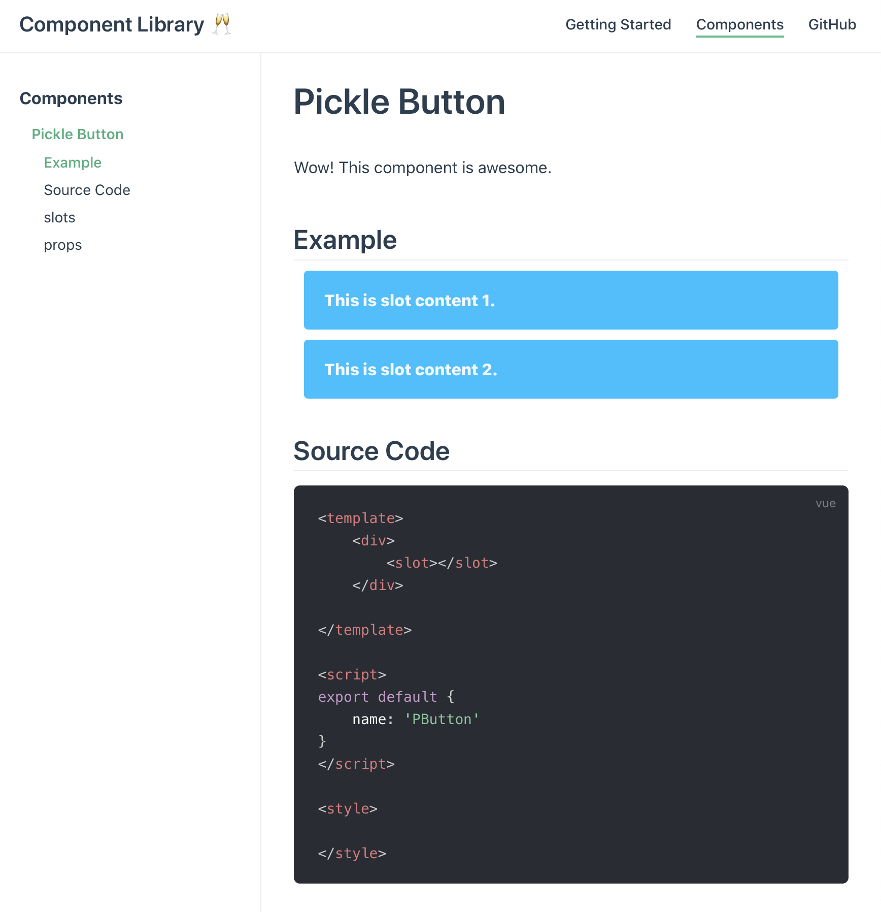

# Vue-component-library with VuePress

A Simple boiler plate to help getting started creating a new Vue Plugin with Component library. All of this served with a nice documentation to showcase your components 🏆.



## Project setup
```
yarn install
```

### Compiles and hot-reloads for development
```
yarn serve
```

### Compiles and minifies for production
```
yarn build
```

### Lints and fixes files
```
yarn lint
```

### Customize configuration
See [Configuration Reference](https://cli.vuejs.org/config/).
